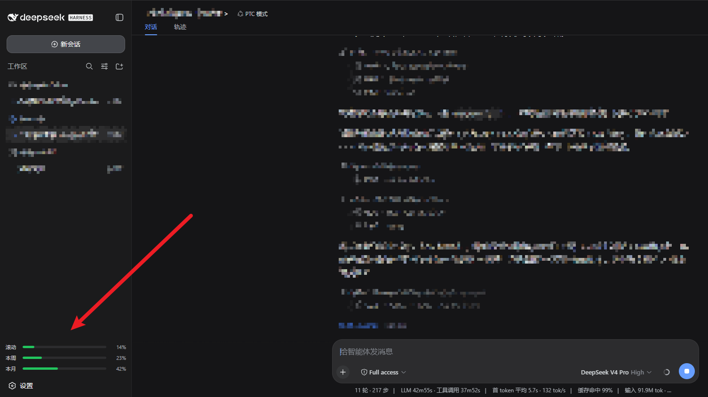

# dsh-plugin-opencode-go

在 DSH Web GUI（http://127.0.0.1:3080）中实时展示 OpenCode Go 套餐的用量与剩余额度。

**密钥不做独立存储**：插件通过 DSH 的凭据服务原生读取 `OPENCODE_GO_API_KEY`
（`~/.dsh/.credentials.yaml`、环境变量或 `.env`，与模型 provider 完全同源），
不复制、不落盘任何单独副本，也不读取 opencode 的 auth.json。

## 功能

- **侧边栏底部**：滚动窗口 / 本周 / 本月三条迷你进度条（已用百分比 + 状态色）。
- **设置页**（左侧设置 → "OpenCode Go 用量"）：
  - 密钥来源提示（显示当前从哪个凭据/环境读取）；
  - 三条用量进度条：滚动窗口 / 本周 / 本月，含已用/剩余百分比与重置倒计时；
  - 每 30 秒自动刷新 + "立即刷新"按钮。
- Host 每 60 秒轮询上游一次；浏览器每 30 秒读本地快照。

## 数据来源

官方 OpenCode Zen Go API：

```
GET https://opencode.ai/zen/go/v1/usage
Authorization: Bearer <API Key>
```

## 安装

1. 把本包放到 `~/.dsh/profiles/web/node_modules/dsh-plugin-opencode-go`。
   最简单的方式是克隆本仓库后做目录链接：

```powershell
git clone https://github.com/CangShui/dsh-opencode-go-usage
$profile = Join-Path $HOME '.dsh/profiles/web/node_modules'
New-Item -ItemType Directory -Force $profile | Out-Null
New-Item -ItemType Junction -Path (Join-Path $profile 'dsh-plugin-opencode-go') -Target (Resolve-Path './dsh-opencode-go-usage')
```

2. 在 `~/.dsh/profiles/web/cordis.patch.yml` 里注册 loader 条目：

```yaml
- insert:
    - id: opencode-go-usage
      name: 'dsh-plugin-opencode-go'
      config:
        refreshMs: 60000
```

3. 重启 dsh web 进程（Host 插件模块由 loader 缓存，需重启才生效）：

```powershell
dsh web
```

   然后浏览器刷新页面（Ctrl+F5）加载新的 Client bundle。

## 配置

| 字段 | 默认值 | 说明 |
| --- | --- | --- |
| `credentialRef` | `OPENCODE_GO_API_KEY` | 从 DSH 凭据服务解析的凭据名 |
| `baseUrl` | `https://opencode.ai` | API 基地址 |
| `refreshMs` | `60000` | Host 轮询上游间隔（毫秒，下限 5000） |

## 密钥管理

- 插件**不保存** API Key。它在 DSH 的模型设置(Models)里已配置的
  `OPENCODE_GO_API_KEY` 处读取，与模型 provider 完全同源。
- 更换密钥：在 DSH 的模型设置(Models)里更新，或设置环境变量
  `OPENCODE_GO_API_KEY`。插件会在下一次轮询（最长 60 秒）自动生效。

## 安全说明

- 本仓库与插件代码**不含任何密钥、密码或 token**。
- 插件只读 DSH 自己的凭据文件（`~/.dsh/.credentials.yaml`），该文件由 DSH
  以仅所有者可读的权限管理（Windows 下为 ACL 保护）；插件不复制、不打印、不外传密钥值。

## 已知情况

- 若 API 返回 `EntitlementError: OpenCode Go subscription required.`，说明该
  密钥对应账号当前没有生效的 Go 套餐，请确认套餐状态或更换订阅账号的密钥。